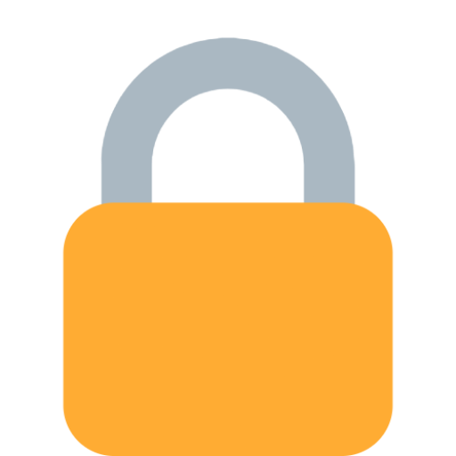

  
  <strong>Secret Generator</strong>

  A <code>static page</code> to create SHA Secret Generator

 

  <!-- HTML Version -->
  

### Table of Contents
- [Demo](#demo)
- [Notes & Limitation](#notes--limitation)
  - [Notes](#notes)
  - [Limitation](#limitation)

## Demo

Please view demo **[here](http://coroo.github.io/secret-generator/)**.

## Notes & Limitation

### Notes

- For every 5 input, the color of the background will changes.

### Limitation

- For now, secret generator only use **SHA1**
